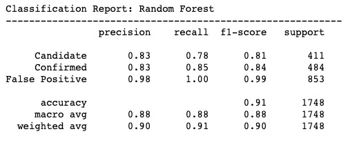

# Exoplanet Explorer Machine Learning Models

## Background

Over a period of nine years in deep space, the NASA Kepler space telescope has been out on a planet-hunting mission to discover hidden planets outside of our solar system.

To help process this data, I created multiple machine learning models capable of classifying candidate exoplanets from the raw dataset.

## Exploring and Selecting the Data

This dataset is a cumulative record of all observed Kepler "objects of interest" and contains an extensive data directory. 

**Exoplanet Achive Information**: The disposition or label in the literature for the exoplanet candidate. One of CANDIDATE, FALSE POSITIVE, NOT DISPOSITIONED or CONFIRMED. (**koi_disposition**)

**Project Disposition Columns**: NASA flags used to identify or assign the foreign body.

**Transit Properties**: Calculated parameters of the object such as  Orbital Period, Transit Epoch, Planet-Star Radius Ratio, Planet-Star Distance over Star Radius and Impact Parameter. _Transit properties contain uncertainty values and are identified with a suffix _err. The margin of error is NOT included in the model_

**Stellar Parameters**: Stellar parameters are observational data used to determine stellar physics. These include effective temperature, surface gravity, metallicity, radius, mass, and ageCalculated parameters of the object such as  Orbital Period, Transit Epoch, Planet-Star Radius Ratio, Planet-Star Distance over Star Radius and Impact Parameter. _Stellar properties contain uncertainty values and are identified with a suffix _err. The margin of error is NOT included in the model_

**KIC Parameters**: Physical properties and target identifier.

[Full Directory of Data Columns Definitions](https://exoplanetarchive.ipac.caltech.edu/docs/API_kepcandidate_columns.html)

- - -

## Pipeline

### 1. Preprocessing the Data

* Data was preprocess prior to fitting the model.
* Removed unnecesary features and performed feature selection
* Use `MinMaxScaler` to scale the numerical data.
* Applied `LabelEncoder` to the categorical labels (__koi_disposition__) for future Neural Network
* Split the data into a training and testing data subset.

### 2. Create Models

* Support Vector Machine Linear Classifier from `sklearn.svm` library
* Logistic Regression from `sklearn.linear_mode` library
* Random Forest from `sklearn.ensemble` library
* kNN Model from `sklearn.neighbors` library
* Neural Networks from `tensorflow.keras.models` library

### 3. Hypertune Model
* Idenitified parameters using `.get_params().keys()`
* Use `GridSearch` to tune model parameters.

- - -

## Model Summary

| Model Name    | Test Score         | Hypertuned Score
| ------------- | :-------------: | :-------------: 
| SVM - Linear  | 0.798  | 0.820
| Logistic Regression  | 0.804  | 0.818
| __Random Forest__  | __0.908__ | __0.905__
| kNN  | 0.797  | 0.802
| Neural Network / Deep Learning | 0.805  | 0.817

After running several models, the algorithm with the highest degree of accuracy for classifying Exoplanets is Random Forest with an accuracy score of 91%. All models tested came quite close with an average score of 80%. While I did hypertune many of these models, more parameters can be assessed in order to improve the accuracy. Secondly, the dataset includes "candidate" exoplanets which provides little to no insight since this candidate can be a false positive or a confirmed exoplanet. The model may be improved by removing all __candidate__ exoplanets and train only on confirmed confirmed exoplanets and non-exoplanets. I ran a confusion matrix to better understand the RandomForest model.

Overall the accuracy of this model is quite high. It appears that this model is extremely accurate at correctly classifying __false positives__ with an F1 score of 0.99. In other words, this model is best a predicted objects of interest that are NOT exoplanets.

## Data Source

* [Exoplanet Data Source](https://www.kaggle.com/nasa/kepler-exoplanet-search-results)

- - -

